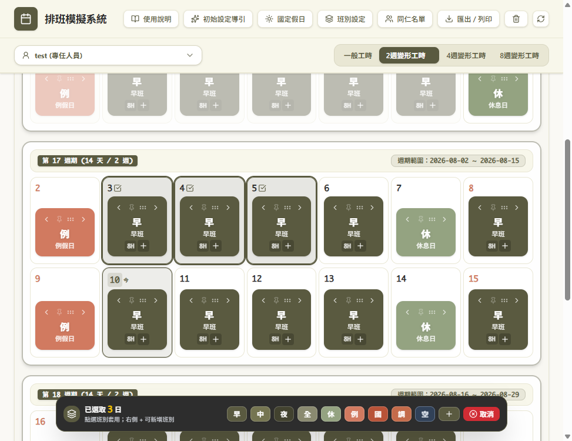
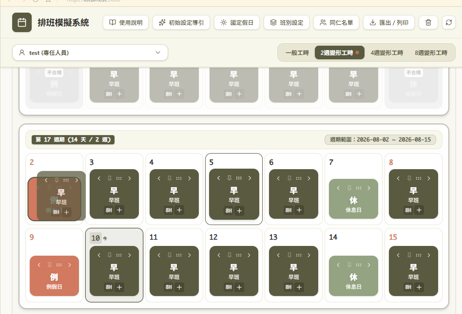
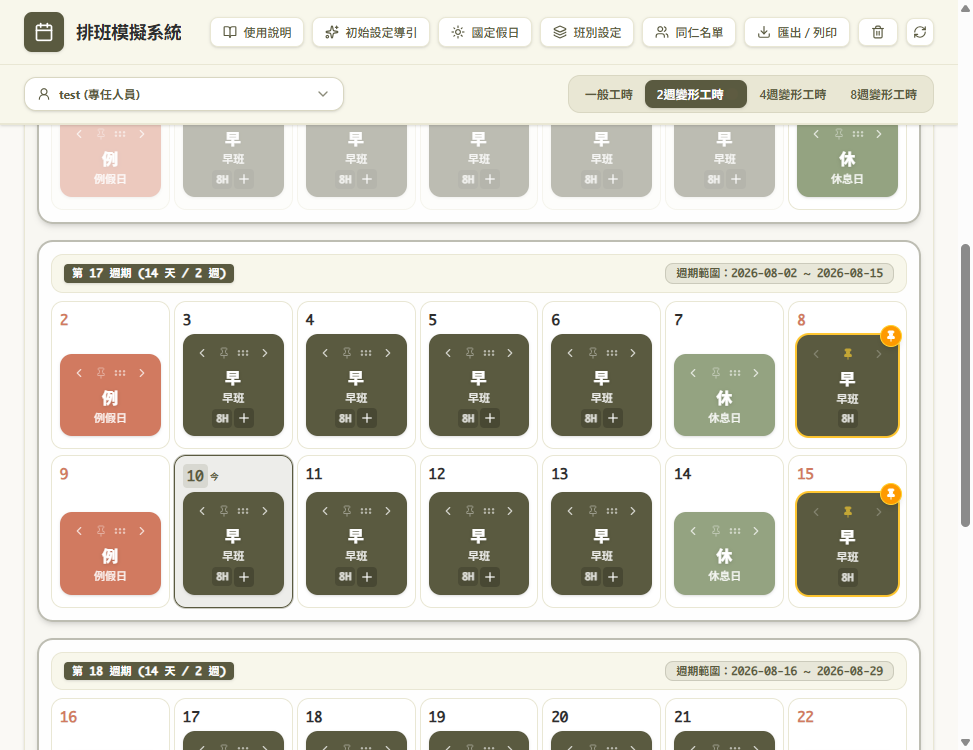
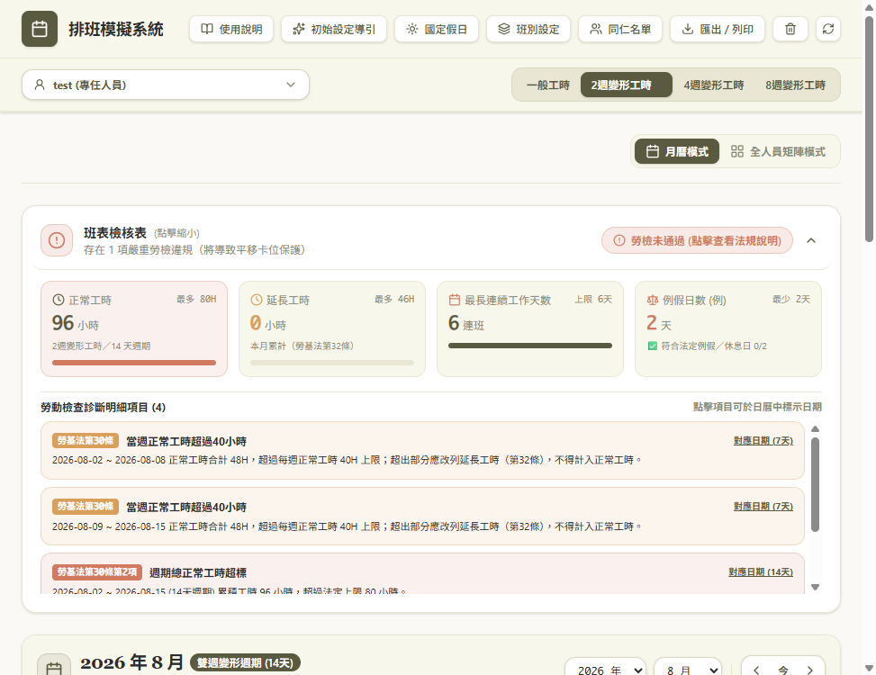

# 排班模擬系統（Labor Law Roster Sim）

離線可用的台灣勞基法排班模擬工具。支援一般工時與 2／4／8 週變形工時即時檢核，並提供班別拖拉、釘選鎖定、加班換休與國定假日補假等操作，協助排班人員在出表前先發現不合規風險。

**線上示範**：[https://labor-law-roster-sim.huangxh8531.workers.dev/](https://labor-law-roster-sim.huangxh8531.workers.dev/)

> **免責聲明**：本工具僅供排班規劃與教育模擬參考，非正式法律意見或勞動檢查結論。實際適用請依現行法令、主管機關函釋及單位人事規範為準。

---

## 功能特色

- **多種工時制度**
  - 一般工時
  - 2 週變形工時（勞基法第 30 條第 2 項）
  - 4 週變形工時（勞基法第 30 條之 1）
  - 8 週變形工時（勞基法第 30 條第 3 項）
- **即時勞基法檢核**  
  連班天數、例假／休息日配額、日／週／週期工時、班距、延長工時上限等，並標示相關法條與對應日期。
- **直覺排班操作**
  - 單選／多選日期後批次套用班別
  - 拖曳交換班別
  - 大頭針釘選，避免誤改
- **加班與換休**  
  以 0.5 小時為單位登錄延長工時，並可自本月加班庫存支用補休。
- **國定假日與補假**  
  內建台灣國定假日資料，支援週末挪移補假（「調」班）及例／休配額替補。
- **雙視圖**  
  月曆檢視、時程／矩陣檢視切換。
- **設定與匯出**  
  同仁、班別、國定假日設定；支援班表／行事曆匯出。
- **離線優先**  
  資料儲存於瀏覽器 `localStorage`，無需後端即可運作。

---

## 畫面預覽

內建使用說明截圖（`public/guide/`）：

| 點選與批次換班 | 拖曳交換 | 釘選鎖定 |
| --- | --- | --- |
|  |  |  |

| 勞檢診斷 | 加班／換休 | 加班警示 |
| --- | --- | --- |
|  |  |  |

---

## 技術棧

| 項目 | 說明 |
| --- | --- |
| 框架 | React 19 + TypeScript |
| 建置 | Vite 6 |
| 樣式 | Tailwind CSS 4（`@tailwindcss/vite`） |
| 日期 | date-fns |
| 圖示 | lucide-react |
| 動畫 | motion |
| 儲存 | 瀏覽器 localStorage（離線） |

---

## 環境需求

- **Node.js**：建議 20 LTS 以上（開發環境驗證過 Node 22）
- **套件管理**：npm（專案內含 `package-lock.json`）
- **瀏覽器**：現代 Chromium／Firefox／Safari（需支援 ES modules 與 localStorage）

---

## 快速開始

```bash
# 1. 進入專案目錄
cd labor-law-roster-sim

# 2. 安裝依賴
npm install

# 3. 啟動開發伺服器（預設 http://localhost:3000）
npm run dev
```

瀏覽器開啟後，首次使用會引導完成同仁／班別等初始設定，即可開始模擬排班。

---

## 可用指令

| 指令 | 說明 |
| --- | --- |
| `npm run dev` | 啟動開發伺服器（port `3000`，`--host 0.0.0.0`） |
| `npm run build` | 產出正式環境靜態檔（`dist/`） |
| `npm run preview` | 預覽 build 結果 |
| `npm run lint` | TypeScript 型別檢查（`tsc --noEmit`） |
| `npm run clean` | 清除建置產物 |

---

## 專案結構

```text
labor-law-roster-sim/
├── public/guide/          # 使用說明截圖
├── src/
│   ├── components/        # UI 元件（月曆、時程、勞檢面板、設定 Modal 等）
│   ├── constants/         # 工時制度、預設班別、加班上限、國定假日
│   ├── utils/             # 勞基法檢核、補假邏輯、對比色等
│   ├── types.ts           # 共用型別定義
│   ├── App.tsx            # 應用主流程與狀態
│   ├── main.tsx           # 入口
│   └── index.css          # 全域樣式
├── index.html
├── package.json
├── vite.config.ts
└── tsconfig.json
```

主要邏輯位置：

- `src/utils/laborLaws.ts`：合規檢核、週期計算、合法拖移邊界
- `src/constants/systems.ts`：四種工時制度參數與法源說明
- `src/constants/overtime.ts`：加班步進與月／週期上限
- `src/utils/holidayMakeup.ts`：國定假日補假命名與相關規則

---

## 使用方式概要

1. **選擇工時制度與同仁**（頁首工具列／系統列）
2. **在月曆或時程視圖排班**  
   點選批次換班、拖曳交換，或釘選需固定之日
3. **依需要登錄加班或支用換休**（工作班卡片底部 `＋`／`−`）
4. **檢視「班表檢核表」與「勞動檢查診斷明細」**  
   依紅字指標與法條說明調整排班
5. **於設定中維護國定假日、班別與同仁**；完成後可匯出

應用程式內建完整操作說明（選單 → 使用指南），可對照截圖逐步練習。

---

## 資料持久化

以下鍵值寫入瀏覽器 `localStorage`（清除網站資料即會遺失）：

| 鍵名 | 內容 |
| --- | --- |
| `perpetual_employees` | 同仁與班表 |
| `perpetual_shifts` | 班別定義 |
| `perpetual_national_holidays` | 國定／補假清單 |
| `perpetual_setup_completed` | 是否完成設定精靈 |

正式部署前若需跨裝置同步或帳號隔離，需另行規劃後端或匯入／匯出策略（現已支援部分行事曆匯出）。

---

## 開發說明

### 建議流程

1. `npm install` 安裝依賴  
2. `npm run dev` 本機開發（支援 HMR）  
3. 修改後執行 `npm run lint` 確認型別  
4. `npm run build` 確認可成功打包  

### 注意事項

- 路徑別名 `@` 指向專案根目錄（見 `vite.config.ts`）。
- 環境變數 `DISABLE_HMR=true` 時會關閉 HMR 與檔案監看（供 AI Studio／agent 編輯場景使用）。
- 新增或調整公開函式、業務規則時，請依專案慣例補上**繁體中文** JSDoc／行內註解。
- 變更工時檢核規則時，請同步核對 `SYSTEM_CONFIGS`、加班常數與診斷文案中的法條引用。

### 建置與部署

```bash
npm run build
```

產出位於 `dist/`，可部署至任何靜態網站託管（GitHub Pages、Cloudflare Workers／Pages、Nginx、IIS 靜態目錄等）。此應用以前端為主，無強制後端依賴。

目前線上環境託管於 Cloudflare Workers：

[https://labor-law-roster-sim.huangxh8531.workers.dev/](https://labor-law-roster-sim.huangxh8531.workers.dev/)

---

## 路線圖

- [ ] 跨裝置雲端備份／還原
- [ ] 更細緻的班距與跨日班視覺化
- [ ] 批次匯入同仁／班表（CSV／Excel）
- [ ] 自動化測試覆蓋核心勞基法規則

歡迎依單位需求擴充；提交變更前請先確認 `npm run lint` 與 `npm run build` 通過。

---

## 授權

本專案目前為私有／內部使用用途（`package.json` 標示 `"private": true`）。